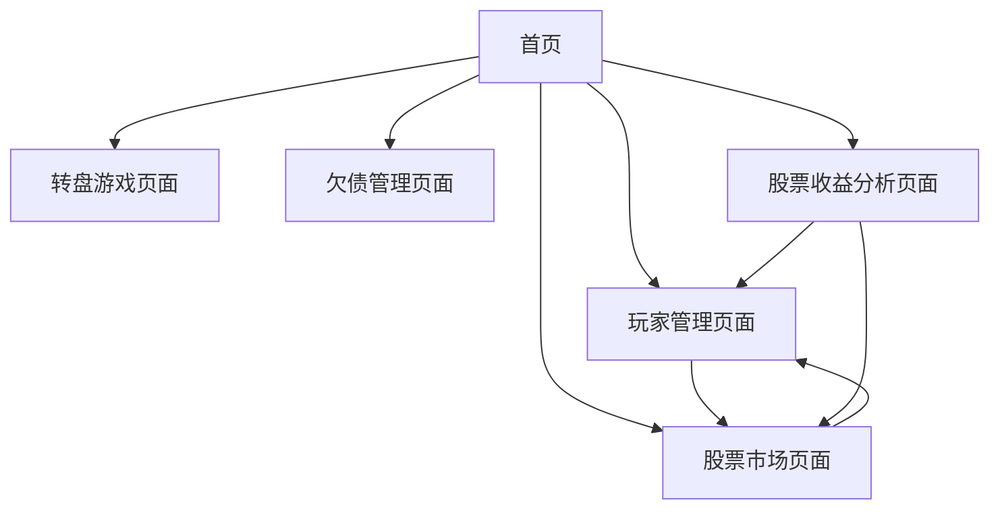

## 1. Product Overview
大富翁辅助网站是一个专为大富翁游戏设计的辅助工具，帮助玩家管理游戏中的各种数据和操作。
- 主要解决大富翁游戏中玩家信息管理、股票交易记录、转盘游戏和欠债管理等问题，为游戏参与者提供便捷的数据管理工具。
- 目标是提升大富翁游戏的体验，让玩家能够更好地跟踪和管理游戏进程。

## 2. Core Features

### 2.1 User Roles
本产品不区分用户角色，所有功能对所有用户开放。

### 2.2 Feature Module
我们的大富翁辅助网站包含以下主要页面：
1. **首页**: 导航菜单，功能入口
2. **玩家管理页面**: 玩家信息管理，股票持有管理，提现功能
3. **股票市场页面**: 股票价格管理，市场信息展示
4. **转盘游戏页面**: 转盘抽奖，倍数设置
5. **欠债管理页面**: 欠款记录，偿还管理
6. **股票收益分析页面**: 收益可视化，交易记录统计

### 2.3 Page Details

| Page Name | Module Name | Feature description |
|-----------|-------------|---------------------|
| 首页 | 导航菜单 | 提供各功能页面的快速入口，展示网站主要功能 |
| 玩家管理页面 | 玩家信息管理 | 添加、编辑、删除玩家信息，包括姓名和颜色设置 |
| 玩家管理页面 | 股票持有管理 | 管理每个玩家的股票持有量，支持增加和减少操作 |
| 玩家管理页面 | 提现功能 | 根据输入金额和当前股价计算需卖出的股票数量，实现股票提现 |
| 玩家管理页面 | 重置功能 | 重置玩家数据为默认设置，清除本地存储缓存 |
| 股票市场页面 | 股票价格管理 | 设置和更新股票当前价格，支持手动输入和快捷调整 |
| 股票市场页面 | 价格历史 | 显示股票价格变化历史记录 |
| 转盘游戏页面 | 转盘抽奖 | 提供可旋转的转盘，支持自定义倍数设置 |
| 转盘游戏页面 | 倍数设置 | 自定义转盘各区域的倍数值 |
| 欠债管理页面 | 欠款记录 | 记录玩家之间或玩家与银行之间的欠款信息 |
| 欠债管理页面 | 新增欠款 | 支持选择债务人、债权人和欠款金额 |
| 欠债管理页面 | 偿还管理 | 提供全部偿还和部分偿还功能，支持输入偿还金额 |
| 股票收益分析页面 | 收益计算 | 计算未实现收益（当前价格减去买入价格）和已实现收益 |
| 股票收益分析页面 | 可视化展示 | 使用图表展示玩家股票收益情况，包括收益趋势 |
| 股票收益分析页面 | 交易记录 | 统计每次股票减少操作（减持、提现）的收益亏损情况 |

## 3. Core Process

### 主要用户操作流程：
1. **玩家管理流程**: 用户进入玩家管理页面 → 添加/编辑玩家信息 → 管理股票持有量 → 进行提现操作
2. **股票交易流程**: 用户进入股票市场页面 → 查看当前价格 → 更新股票价格 → 返回玩家管理进行交易
3. **转盘游戏流程**: 用户进入转盘游戏页面 → 设置倍数 → 旋转转盘 → 查看结果
4. **欠债管理流程**: 用户进入欠债管理页面 → 新增欠款记录 → 管理偿还操作
5. **收益分析流程**: 用户进入股票收益分析页面 → 查看收益可视化 → 分析交易记录 → 了解盈亏情况

## 4. User Interface Design
### 4.1 Design Style
- **主色调**: 蓝色系 (#3B82F6) 作为主色，白色 (#FFFFFF) 作为背景色
- **辅助色**: 灰色系 (#6B7280, #9CA3AF) 用于次要信息，绿色 (#10B981) 表示正收益，红色 (#EF4444) 表示负收益
- **按钮样式**: 圆角按钮，支持悬停效果和点击反馈
- **字体**: 系统默认字体，标题使用较大字号 (text-xl, text-2xl)，正文使用标准字号 (text-sm, text-base)
- **布局风格**: 卡片式布局，响应式设计，支持移动端适配
- **图标样式**: 使用 Lucide React 图标库，简洁现代的线性图标

### 4.2 Page Design Overview

| Page Name | Module Name | UI Elements |
|-----------|-------------|-------------|
| 首页 | 导航菜单 | 网格布局的功能卡片，每个卡片包含图标、标题和描述，使用蓝色主题 |
| 玩家管理页面 | 玩家信息管理 | 玩家卡片列表，每个卡片显示玩家名称、颜色标识、股票信息和操作按钮 |
| 玩家管理页面 | 股票持有管理 | 输入框和加减按钮，实时显示股票数量和价值 |
| 玩家管理页面 | 提现功能 | 输入框、计算按钮和确认对话框，显示提现金额和对应股票数量 |
| 股票市场页面 | 股票价格管理 | 大号价格显示，输入框和快捷调整按钮，价格历史列表 |
| 转盘游戏页面 | 转盘抽奖 | 圆形转盘，彩色扇形区域，中央旋转按钮，结果显示区域 |
| 欠债管理页面 | 欠款记录 | 欠款卡片列表，显示债务关系、金额和操作按钮 |
| 欠债管理页面 | 新增欠款 | 下拉选择框、金额输入框和确认按钮 |
| 股票收益分析页面 | 收益可视化 | 图表组件展示收益趋势，使用绿色表示盈利，红色表示亏损 |
| 股票收益分析页面 | 交易记录 | 表格形式展示交易历史，包括时间、操作类型、数量、价格和收益 |

### 4.3 Responsiveness
产品采用移动端优先的响应式设计，支持触摸交互优化，在不同屏幕尺寸下都能提供良好的用户体验。